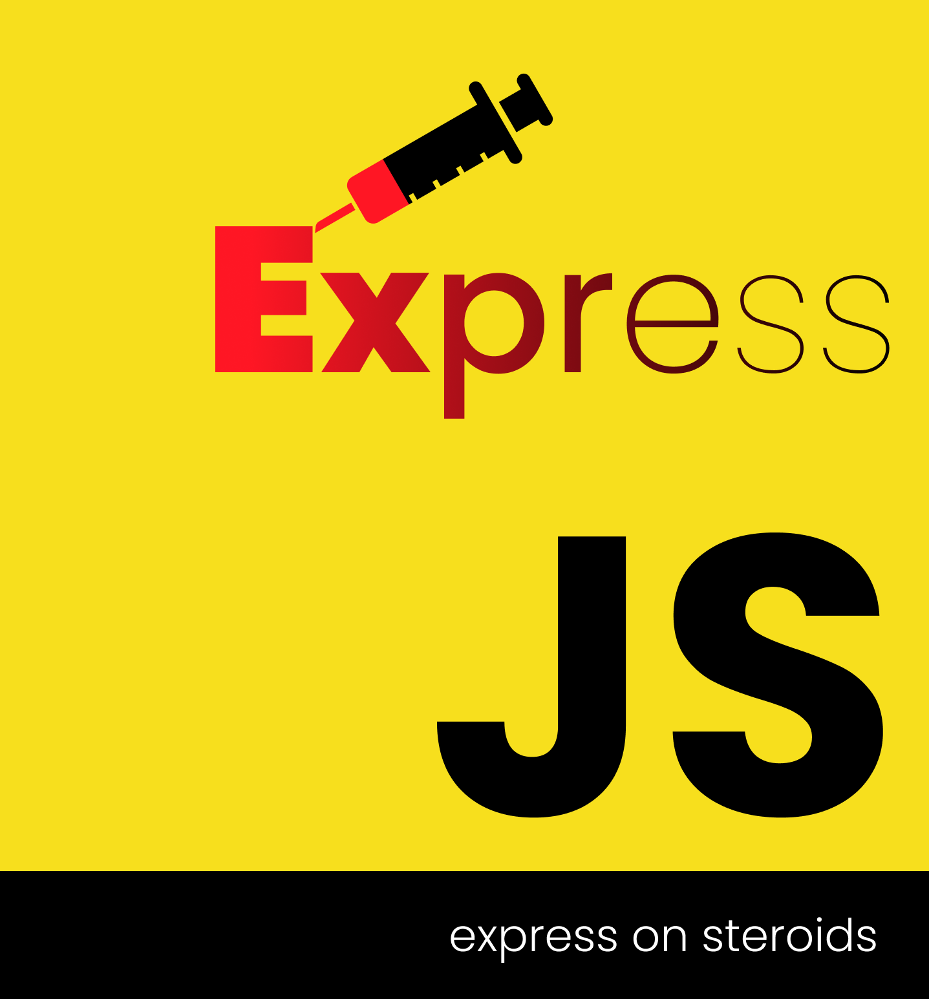

# express-on-steroids  

 

 
express on steroids is architecture which dictates defining api structure as JSON. It hides express related specificity and tries to achieve as many things dynamically as possible.

## Available scripts
In the project directory, you can run:

> npm start

To serve the app on http://127.0.0.1:3000 .

OR 

use,
> npm run dev  

To serve the app on http://127.0.0.1:3000 in monitored mode.

The app will reload when you make changes.

## Docker

### Build image

> docker build -t express-on-steroids .

### Create and run container

> docker run -itp 3000:3000 --name eos-container express-on-steroids

access the running container on http://127.0.0.1:3000

### Open a shell in express-on-steroids

> docker run -it --name eos-container express-on-steroids sh  

### stop and remove eos-container, and then rebuild new image and run new container
> docker stop /eos-container; docker rm /eos-container; docker build -t express-on-steroids .; docker run -itp 3000:3000 --name eos-container express-on-steroids

## On a quest to find documentation?
[Here's a map](./doc/index.md)